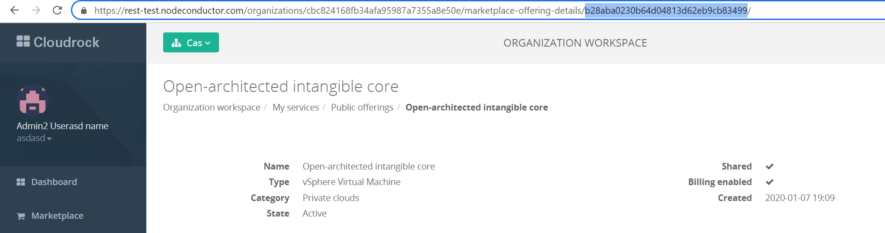

# Cloudrock Docker-compose deployment

## Prerequisites

- at least 8GB RAM on Docker Host to run all containers
- Docker v1.13+

## Prepare environment

```bash
# clone repo
git clone https://github.com/kubeworkz/cloudrock-docker-compose.git
cd cloudrock-docker-compose
# setup settings
cp .env.example .env
```

## Booting up

```bash
# start containers
docker-compose up -d

# verify
docker-compose ps
docker exec -t cloudrock-metal-worker status

# Create user
docker exec -t cloudrock-metal-worker cloudrock createstaffuser -u admin -p password -e admin@example.com

# Create demo categories for OpenStack: Virtual Private Cloud, VMs and Storage
docker exec -t cloudrock-metal-worker cloudrock load_categories vpc vm storage
```

Cloudrock UI will be accessible on [http://localhost](http://localhost).
API will listen on [http://localhost/api](http://localhost/api).

Healthcheck can be accessed on [http://localhost/health-check](http://localhost/health-check).

Tearing down and cleaning up:

```bash
docker-compose down
```

## Logs

Logs emitted by the containers are collected and saved in the `cloudrock_logs` folder. You can change the location by
editing environment variable (`.env`) and updating `LOG_FOLDER` value.

## Known issues

When Cloudrock is launched for the first time, it applies initial database migrations.
It means that you may need to wait few minutes until these migrations are applied.
Otherwise you may observe HTTP error 500 rendered by REST API server.
This issue would be resolved after upgrade to [Docker Compose 1.29](https://docs.docker.com/compose/release-notes/#1290).

## Upgrading Cloudrock

```bash
docker-compose pull
docker-compose restart
```

## Using TLS

This setup supports following types of SSL certificates:

- Email - set environment variable TLS to your email to register Let's Encrypt account and get free automatic SSL certificates.

Example:

```bash
TLS=my@email.com
```

- Internal - set environment variable TLS to "internal" to generate self-signed certificates for dev environments

Example:

```bash
TLS=internal
```

- Custom - set environment variable TLS to "cert.pem key.pem" where cert.pem and key.pem - are paths to your custom certificates (this needs modifying docker-compose with path to your certificates passed as volumes)

Example:

```bash
TLS=cert.pem key.pem
```

## Custom Caddy configuration files

To add additional caddy config snippets into the caddy virtual host configuration add .conf files to config/caddy-includes/

## Keycloak

Keycloak is an Identity and Access Management software bundled with cloudrock-docker-compose.

To create a keycloak admin account run:

```bash
docker exec keycloak /opt/jboss/keycloak/bin/add-user-keycloak.sh -u <USERNAME> -p <PASSWORD>
docker restart keycloak
```

Login to the admin interface at [https://localhost/auth/admin](https://localhost/auth/admin) and create Cloudrock users

## Integration with SLURM

SLURM integration requires several major actions.

The preparation step is creation of a shared network for Cloudrock and FireCREST:

```bash
docker network create cloudrock-external
```

This network will be used for communication between Cloudrock and FireCREST services.

### Deployment of FirecREST

**NB**: FirecREST integration is not implemented for now. Better check the [Cloudrock SLURM service setup](#service-provider-setup).

The first step is deployment of [FirecREST demo](https://github.com/eth-cscs/firecrest). This repository includes build-in SLURM cluster together with FirecREST application itself and several utils (keycloak, minio, jaeger, openapi). An user needs to replace the default keycloak configuration in the firecrest repository. For this, the user should execute the following commands:

```bash
cat config/firecrest-override/config.json > firecrest/deploy/demo/keycloak/config.json
cat config/firecrest-override/client_secrets.json > firecrest/deploy/demo/demo_client/client_secrets.json
cat config/firecrest-override/docker-compose.yml > firecrest/deploy/demo/docker-compose.yml
```

Firecrest deployment can be started with these commands:

```bash
cd firecrest
docker build -f deploy/docker/base/Dockerfile . -t f7t-base
cd deploy/demo/
chmod 400 ../test-build/environment/keys/ca-key ../test-build/environment/keys/user-key
docker-compose build --build-arg SLURM_VERSION=20.11.9
docker-compose up -d
```

### Update of Cloudrock setup

Cloudrock setting should be updated in order to interact with Keycloak service from FireCREST and with [FreeIPA demo](https://www.freeipa.org/page/Demo).

```bash
cat config/firecrest-override/override.conf.py > config/cloudrock-metal/override.conf.py
```

The deployment should be restarted with the fresh settings.

```bash
docker compose down
docker compose up -d
```

### Service provider setup

After this, the service provider should import the SLURM cluster to Cloudrock. This can be done on Cloudrock marketplace level, so the result is an offering with the corresponding data.

- Go to `Public services` -> `Public offerings` -> `Add offering`
- Input name and other offering details and choose `SLURM remote allocation` in "Management" tab
- In the page of the new offering, copy uuid from URL (see image below)



The copied value will be used for deployment of Cloudrock-SLURM integration service as `CLOUDROCK_OFFERING_UUID` variable.

- Go to user management tab, set API token lifetime to `token will not time out` and click `Update profile` button. See [the example](https://docs.cloudrock.ca/integrator-guide/APIs/authentication/#authentication-token-management) for more details
- Copy value from `Current API token` field. This value will be used as `CLOUDROCK_API_TOKEN`

The value of `CLOUDROCK_API_TOKEN` and `CLOUDROCK_OFFERING_UUID` variables should be adjusted in `config/cloudrock-slurm-service/service-pull-env` and `config/cloudrock-slurm-service/service-push-env` files.

### Deployment of Cloudrock SLURM service

The final action is deployment of `cloudrock-slurm-service` module, which is responsible for data synchronization between Cloudrock and SLURM cluster and modification of corresponding object states in these 2 systems. The user needs to start the deployment in the following way in order to enable `cloudrock-slurm-service` module:

```bash
docker compose -f docker-compose.yml -f cloudrock-slurm-service.yml up -d
```

For more configuration details, check [Cloudrock SLURM service guide](https://code.cloudrock.ca/cloudrock/cloudrock-slurm-service/-/blob/main/README.md).
