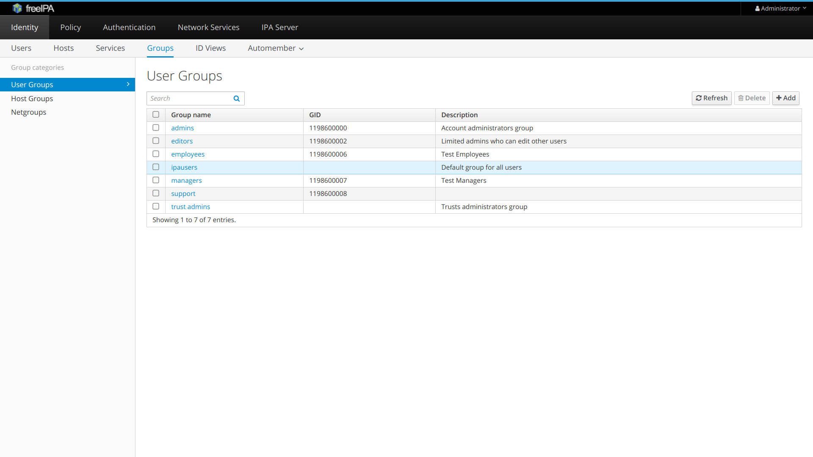
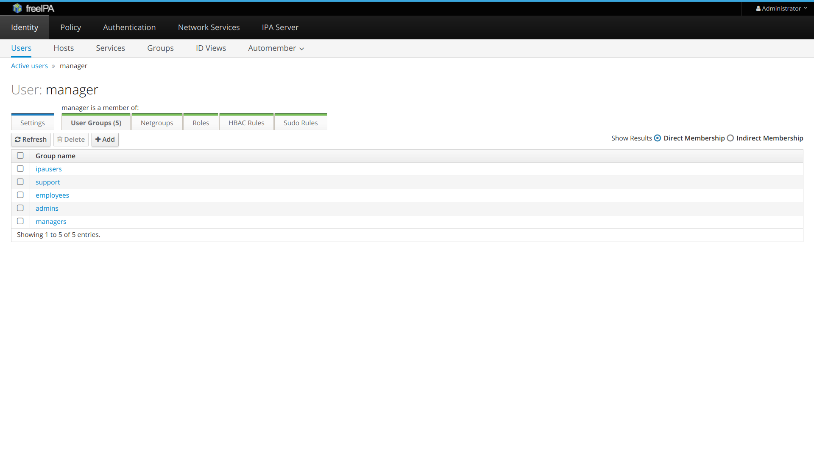
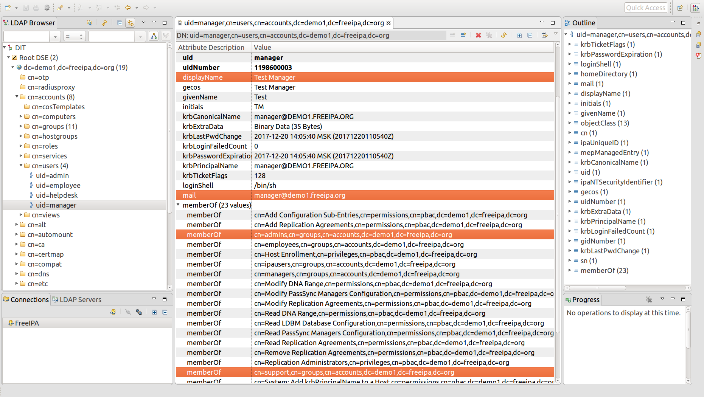
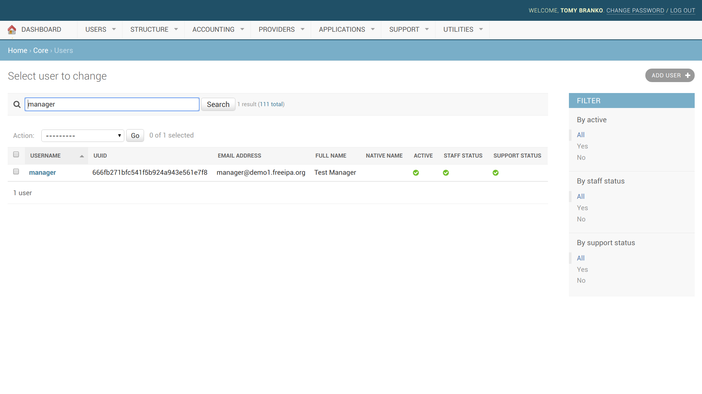
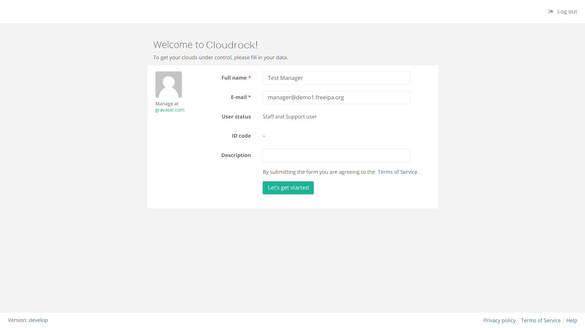

# LDAP

Cloudrock allows you to authenticate using identities from a LDAP server.

## Prerequisites

- Below it is assumed that LDAP server is provided by FreeIPA. Although LDAP authentication would work with any other
  LDAP server as well, you may need to customize configuration for Cloudrock Metal.
- Please ensure that Cloudrock Metal API server has access to the LDAP server. By default LDAP server listens
  on TCP and UDP port 389, or on port 636 for LDAPS (LDAP over SSL). If this port is filtered out by firewall,
  you wouldn't be able to authenticate via LDAP.
- You should know LDAP server URI, for example, FreeIPA demo server has ``ldap://ipa.demo1.freeipa.org``.
- You should know username and password of LDAP admin user. For example, FreeIPA demo server uses
  username=admin and password=Secret123.

### Add LDAP configuration to Cloudrock Metal configuration

Example configuration is below, please adjust to your specific deployment.

```python
import ldap
from django_auth_ldap.config import LDAPSearch, GroupOfNamesType

# LDAP authentication.
# See also: https://django-auth-ldap.readthedocs.io/en/latest/authentication.html
AUTHENTICATION_BACKENDS += (
    'django_auth_ldap.backend.LDAPBackend',
)

AUTH_LDAP_SERVER_URI = 'ldap://ipa.demo1.freeipa.org'

# Following variables are not used by django-auth-ldap,
# they are used as templates for other variables
AUTH_LDAP_BASE = 'cn=accounts,dc=demo1,dc=freeipa,dc=org'
AUTH_LDAP_USER_BASE = 'cn=users,' + AUTH_LDAP_BASE

# Format authenticating user's distinguished name using template
AUTH_LDAP_USER_DN_TEMPLATE = 'uid=%(user)s,' + AUTH_LDAP_USER_BASE

# Credentials for admin user
AUTH_LDAP_BIND_DN = 'uid=admin,' + AUTH_LDAP_USER_BASE
AUTH_LDAP_BIND_PASSWORD = 'Secret123'

# Populate the Django user from the LDAP directory.
AUTH_LDAP_USER_ATTR_MAP = {
    'full_name': 'displayName',
    'email': 'mail'
}

# Set up the basic group parameters.
AUTH_LDAP_GROUP_BASE = "cn=groups," + AUTH_LDAP_BASE
AUTH_LDAP_GROUP_FILTER = "(objectClass=groupOfNames)"
AUTH_LDAP_GROUP_SEARCH = LDAPSearch(AUTH_LDAP_GROUP_BASE,
    ldap.SCOPE_SUBTREE, AUTH_LDAP_GROUP_FILTER)
AUTH_LDAP_GROUP_TYPE = GroupOfNamesType(name_attr="cn")

AUTH_LDAP_USER_FLAGS_BY_GROUP = {
    'is_staff': 'cn=admins,' + AUTH_LDAP_GROUP_BASE,
    'is_support': 'cn=support,' + AUTH_LDAP_GROUP_BASE,
}

```

Configuration above is based on LDAP server exposed by FreeIPA. To make it work, there are some things
that need to be verified in FreeIPA:

1. Ensure that admins and support groups exist in LDAP server. You may do it using FreeIPA admin UI.
    [](img/freeipa-groups.png)
1. If user is assigned to admins group in LDAP, he becomes staff in Cloudrock.
    If user is assigned to support group in LDAP, he becomes support user in Cloudrock.
    For example, consider the manager user which belong to both groups:

[](img/manager-freeipa.png)

## Field mapping

``displayName`` attribute in LDAP is mapped to full_name attribute in Cloudrock.
``mail`` field in LDAP is mapped to email attribute in Cloudrock.

Consider for example, the following user attributes in LDAP:

[](img/manager-ldap-explorer.png)

Here's how it is mapped in Cloudrock:

[](img/manager-django-admin.png)

And here's how it is displayed when user initially logs into Cloudrock via Cloudrock UI:

[](img/manager-cloudrock.png)
