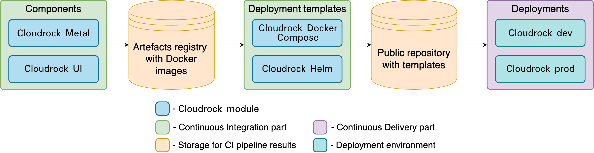
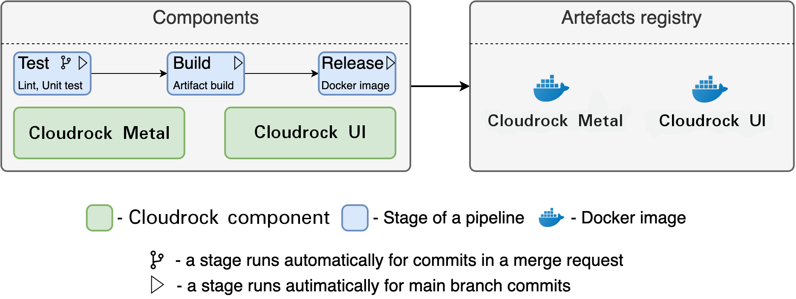
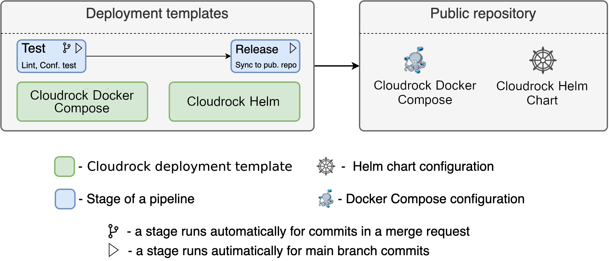
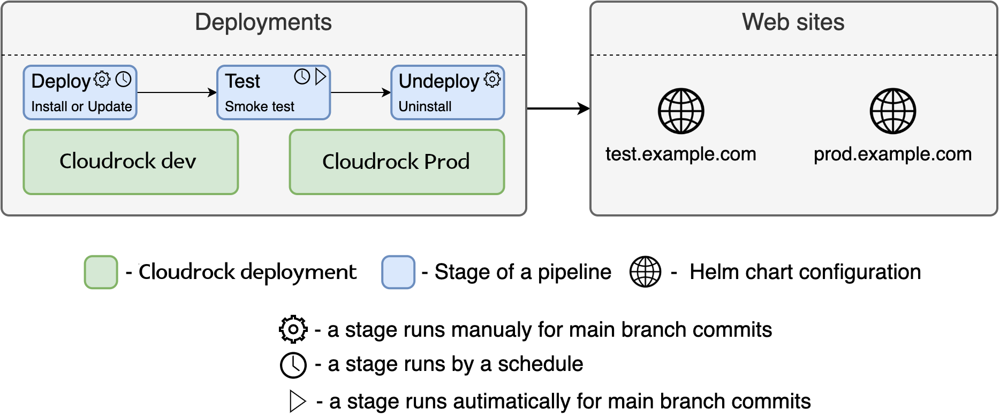

# Cloudrock CI/CD

## General Architecture

Cloudrock uses CI/CD approach for testing, packaging and deployment. The approach is implemented with GitLab CI system. It provides a framework for building pipelines. A pipeline consists of a sequence of stages, each of which depends on the result of a predecessor and includes smaller parts called jobs. A job is a sequence of actions executed for a specific purpose, e.g., testing an application.

The entire CI/CD pipeline consists of smaller pipelines, each of which resides in a corresponding repository and belongs to a particular part.

The CI pipelines are created for the following modules:

- Cloudrock Metal - REST API backend
- Cloudrock UI - frontend module
- Cloudrock Docker Compose - configuration for single-node deployment via Docker Compose
- Cloudrock Helm Chart - package with templates of [Kubernetes](https://kubernetes.io/) manifests for workload resources

The CD pipelines were created for several Cloudrock deployments like Cloudrock development or production.

The following diagram illustrates the general picture of the pipeline.

## Pipeline architecture for Cloudrock Components

Cloudrock components are the separate applications of Cloudrock. The two major ones are Cloudrock Metal and Cloudrock UI.

There are three main stages in the pipeline:

- Test, where the source code lint and unit testing takes place. This stage runs for each commit in a merge request and for the main branch commits;
- Build, where Docker image is being built. This stage runs for the main branch commits;
- Release, where Docker image from the last stage is being published in [Docker Hub](https://hub.docker.com/) registry. This stage runs for the main branch commits.

## Pipeline architecture for Cloudrock Deployment Templates

Cloudrock deployment templates are the configurations for different deployment environments. Currently, Cloudrock supports Docker Compose and Kubernetes. The structure of the latter one is based on [Helm](https://helm.sh/) technology. The pipeline is shown below.

This pipeline includes two stages:

- Test, where the source code lint and configuration testing takes place. This stage runs for each commit in a merge request and the main branch commits;
- Release, where the configuration is published to [GitHub](https://github.com/). This step is implemented with [GitLab mirroring](https://docs.gitlab.com/ee/user/project/repository/mirror/push.html).

## Pipeline architecture for Cloudrock Deployments

In this context, deployments are repositories with values for further insertion into Cloudrock Deployment Templates. For example, they can be values for environmental variables used in Cloudrock containers. The pipeline is shown below.

There are three independent stages:

- Deploy, where Cloudrock release is installed or updated. This stage runs only for main branch commits. For Docker Compose environment, this stage is triggered automatically. For Kubernetes, it runs automatically only for update operations, while installation requires a manual trigger. Also, the update action runs by a schedule, e.g. at 5 AM;
- Test, where the running Cloudrock instance is tested. For example, it checks availability via HTTP requests sent to public Cloudrock endpoints;
- Undeploy, which removes the Cloudrock instance. This stage can be triggered only manually.
