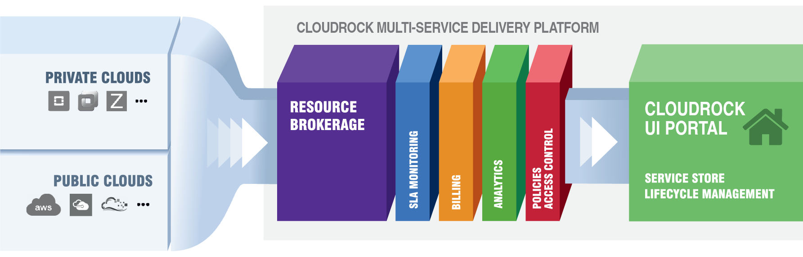

# Introduction

Cloudrock is a platform for managing hybrid cloud resources. It is used both for controlling internal enterprise IT resources and
for selling cloud services. Cloudrock is composed of the following main components:

- Cloudrock Metal - broker and orchestrator of cloud services. Responsible for technical service delivery and
    connected matters. Exposes REST API for management
- Cloudrock UI - web-based self-service portal. Talks REST to Metal.

Cloudrock is open-source, extendable and comes with a [professional support](about/support.md) provided by CloudRock.

To get a quick feeling what Cloudrock is, take a look at some [screenshots](about/screenshots.md).

If you are interested in deploying, check the [getting started](getting-started.md) section!

